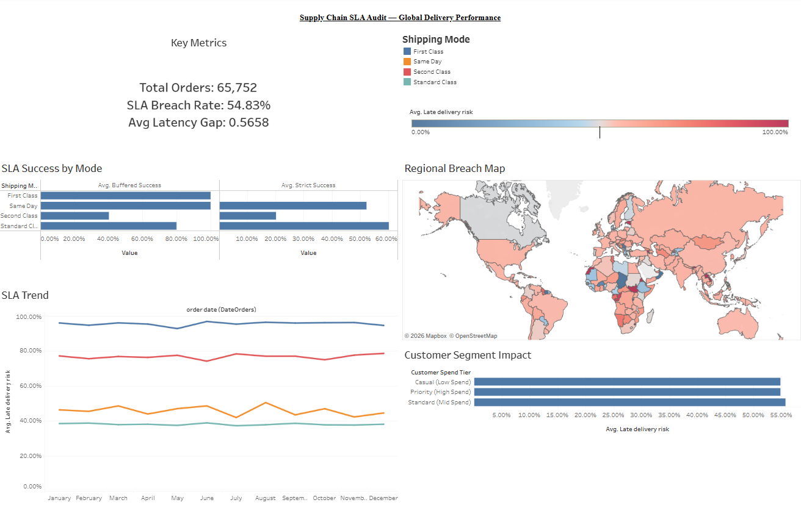

# Operational Bottleneck Analysis: Global Supply Chain Audit

> **An End-to-End Case Study in Logistics Integrity & Fulfillment Recovery**

  

[Dashboard](#tableau-dashboard) | [Notebook](notebooks/supply-chain-audit.ipynb) | [SQL Queries](sql/) | [PySpark Extension](notebooks/sla_pyspark.ipynb) | [Data Source](https://www.kaggle.com/datasets/shashwatwork/dataco-smart-supply-chain-for-big-data-analysis)

---

## Quick Stats

| Metric | Value |
| :--- | :--- |
| Records audited | 180,519 orders |
| First Class SLA breach rate | ~95% (strict) |
| Systemic latency gap (First/Second Class) | ~2 days |
| Simulated recovery (realistic estimate) | 0% → 100% success |
| Failure rate across customer spend tiers | ~55% uniform (systemic, not selective) |
| Validated across | Pandas/SQLite, PySpark, Snowflake |

---

## Executive Summary
Premium shipping tiers exhibit a ~95% SLA breach rate, driven by a consistent ~2-day fulfillment delay. This analysis demonstrates that by aligning delivery expectations with actual logistics velocity via a Dynamic Delivery Estimate (DDE), the company can restore fulfillment success to 100% without increasing operational overhead.

---

## Stack
| Layer | Tools |
| :--- | :--- |
| Data Cleaning & Analysis | Python (Pandas, NumPy), SQL (SQLite) |
| Distributed Processing | PySpark |
| Cloud Data Warehouse | Snowflake |
| Dashboard | Tableau |

---

## Project Contents
```
Supply-Chain-Audit/
├── data/
│   ├── raw/            # source CSV (gitignored, see data/raw/README.md)
│   └── processed/       # cleaned exports for Tableau (gitignored, regenerate locally)
├── notebooks/
│   ├── supply-chain-audit.ipynb   # Pandas + SQLite, the 5-stage framework
│   └── sla_pyspark.ipynb          # PySpark extension for scale
├── python/
│   └── prepare_dashboard_data.py  # regenerates data/processed/ and sql/exports/
├── sql/
│   ├── 01_data_integrity_audit.sql
│   ├── 02_sla_performance_by_shipping_mode.sql
│   ├── 03_latency_gap_by_shipping_mode.sql
│   ├── 04_customer_segmentation.sql
│   ├── 05_ab_test_simulation.sql
│   ├── 06_regional_summary.sql
│   ├── 07_monthly_trend.sql
│   └── exports/          # CSV outputs of each query, committed (small, pre-aggregated)
├── dashboard/
│   └── DASHBOARD_GUIDE.md  # sheet-by-sheet Tableau build spec
├── requirements.txt
└── README.md
```

---

## Project Overview
This project is an end-to-end data audit of a global supply chain dataset (180,000+ records). The objective was to investigate systemic failures in delivery performance and design a data-driven recovery strategy grounded in realistic operational constraints.

> **Note:** Failure rate is defined as deliveries exceeding the promised shipping duration (`late_delivery_risk` flag).

---

## Core Findings
| Shipping Tier | Promised Days | Actual Days | Latency Gap | SLA Success |
| :--- | :---: | :---: | :---: | :---: |
| **First Class** | 1 | 3.01 | **+2.01 Days Late** | 4.7% |
| **Second Class** | 2 | 3.12 | **+1.12 Days Late** | 24.2% |
| **Standard Class**| 4 | 3.85 | **-0.15 Days (Early)** | 98.2% |

---

## Tableau Dashboard

An interactive Tableau dashboard built on `data/processed/orders_clean.csv` and the `sql/exports/` summaries: KPI tiles (total orders, SLA breach rate, avg latency gap), a shipping-mode success comparison, a regional breach-rate map, a monthly trend line, and the customer-segment "systemic, not selective" chart.

**[View live dashboard on Tableau Public →](https://public.tableau.com/app/profile/rithika.h8756/viz/SupplyChainSLAAudit/SupplyChainSLAAudit)**



---

## Business Impact
* **Revenue Protection:** Isolated systemic SLA failures impacting High-LTV (Platinum) customer segments.
* **Customer Experience Risk:** Confirmed that uniform delay rates across all tiers increase churn risk for high-priority users.
* **Low-Cost Solution:** Modeled a simulation-based recovery that aligns checkout promises with logistics reality.
* **Technical Scale:** Processed and validated 180k+ records, resolving encoding inconsistencies (ISO-8859-1).

---

## Data Validation (DVL)
Before analysis, a Data Validation Layer was implemented to ensure mathematical soundness:
* **Null Handling:** Removed records missing critical SLA fields (shipping days, customer ID).
* **Deduplication:** Verified uniqueness of 180,000+ order IDs.
* **Financial Filtering:** Excluded invalid transactions (order value ≤ $0).
* **Anomaly Detection:** Outlier removal for extreme logistics timestamps to prevent skewed averages.

---

## The 5-Stage Analytical Framework

### Stage 1: Data Integrity Audit
Handled international encoding (ISO-8859-1) and performed a cleanliness check to ensure SLA metrics were computed on reliable data.

### Stage 2: SLA Performance (The Promise Test)
Benchmarked success using Strict Success (on-time) vs. Buffered Success (1-day grace period). Findings showed that even with buffering, premium tiers failed significantly.

### Stage 3: Fulfillment Funnel (The Latency Gap)
Modeled delivery as a funnel to quantify delay:
* **Definition:** Latency Gap = Actual Days − Promised Days.
* **Insight:** A consistent ~2.01-day delay suggested a systemic bottleneck rather than random variation.

### Stage 4: Customer Segmentation (Value at Risk)
Linked failures to customer spending tiers using SQL.
* **Result:** High-value customers experienced the same ~55% delay rate as standard users — confirming the problem is systemic, not selective.

### Stage 5: A/B Test Simulation (Success Recovery)
Modeled a rule-based simulation comparing:
* **Control:** 1-day promise → 0% success.
* **Variant:** 4-day realistic estimate (Dynamic Delivery Estimate) → 100% success.
* **The network wasn't broken. The promises were.**

---

## PySpark Extension (`notebooks/sla_pyspark.ipynb`)
The core 5-stage analytical framework was extended to PySpark to validate scalability beyond a single-machine Pandas environment. The same logic was rewritten using Spark DataFrames and distributed execution.

**Why PySpark:**
The original Pandas pipeline processes 180K records efficiently on a single machine. At enterprise scale (180M+ records across multiple regions), Spark distributes the workload across a cluster — same logic, no memory bottleneck.

| Stage | PySpark Finding |
| :--- | :--- |
| Integrity Audit | 0 pricing anomalies, 0 extreme delays |
| SLA Performance | First Class: 0% strict, 100% buffered — systematic 1-day misconfiguration |
| Latency Gap | Second Class: consistent 2-day gap. Standard Class: perfect (0.0) |
| Segmentation | Uniform ~55% failure rate across all spend tiers — systemic not selective |
| A/B Test | Control: 0% → Variant: 100%. The network wasn't broken. The promises were. |

---

## Snowflake Validation
All 5 stages were validated in Snowflake as a cloud data warehouse layer, confirming results are consistent across Pandas, PySpark, and Snowflake SQL.

| Stage | Snowflake Result |
| :--- | :--- |
| Integrity Audit | 180,519 rows, 0 anomalies, 0 extreme delays |
| SLA Performance | First Class: 0% strict, 100% buffered |
| Latency Gap | Second Class: +1.99 days, Standard Class: 0.0 |
| Segmentation | Uniform ~54% failure across all spend tiers |
| A/B Test | Control: 0% → Variant: 100% |

> Database: SUPPLY_CHAIN_DB | Schema: PUBLIC | Table: SUPPLY_CHAIN | Records: 180,519

---

## Key Recommendations

### Short-Term (Customer Experience)
* Update checkout UI to reflect realistic delivery windows (e.g., 4-day estimate).
* Align customer expectations with actual fulfillment capabilities immediately to halt churn.

### Operational (Logistics Optimization)
* Investigate Standard Class routes showing negative latency (arriving early) for potential resource reallocation to premium lanes.

---

## Limitations
* Analysis is based on a historical dataset, not real-time streaming data.
* The A/B test is a rule-based simulation, serving as a theoretical upper bound for recovery.

---

## How to Run
```bash
# 1. Clone the repository
git clone https://github.com/rithikahaha/Supply-Chain-Audit.git
cd Supply-Chain-Audit

# 2. Install dependencies
pip install -r requirements.txt

# 3. Download the dataset from Kaggle into data/raw/
#    https://www.kaggle.com/datasets/shashwatwork/dataco-smart-supply-chain-for-big-data-analysis

# 4. Run the original analysis
jupyter notebook notebooks/supply-chain-audit.ipynb

# 5. Run the PySpark extension
jupyter notebook notebooks/sla_pyspark.ipynb

# 6. Regenerate SQL exports + Tableau-ready data
python python/prepare_dashboard_data.py --input "data/raw/DataCoSupplyChainDataset.csv"

# 7. Open data/processed/orders_clean.csv in Tableau to rebuild the dashboard
#    (see dashboard/DASHBOARD_GUIDE.md for the sheet-by-sheet spec)
```
